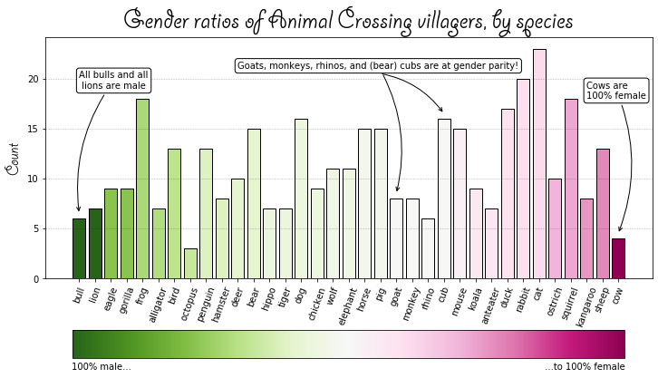
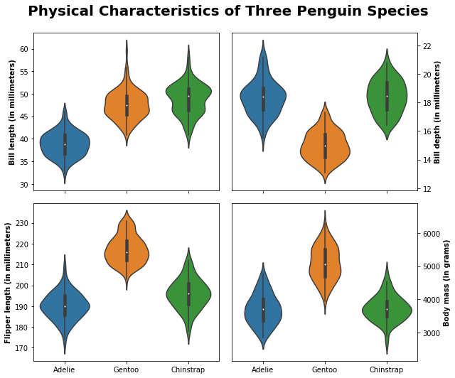
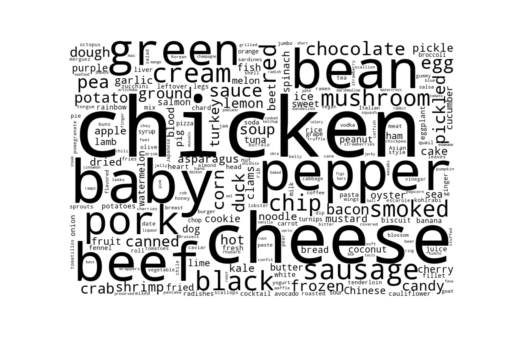
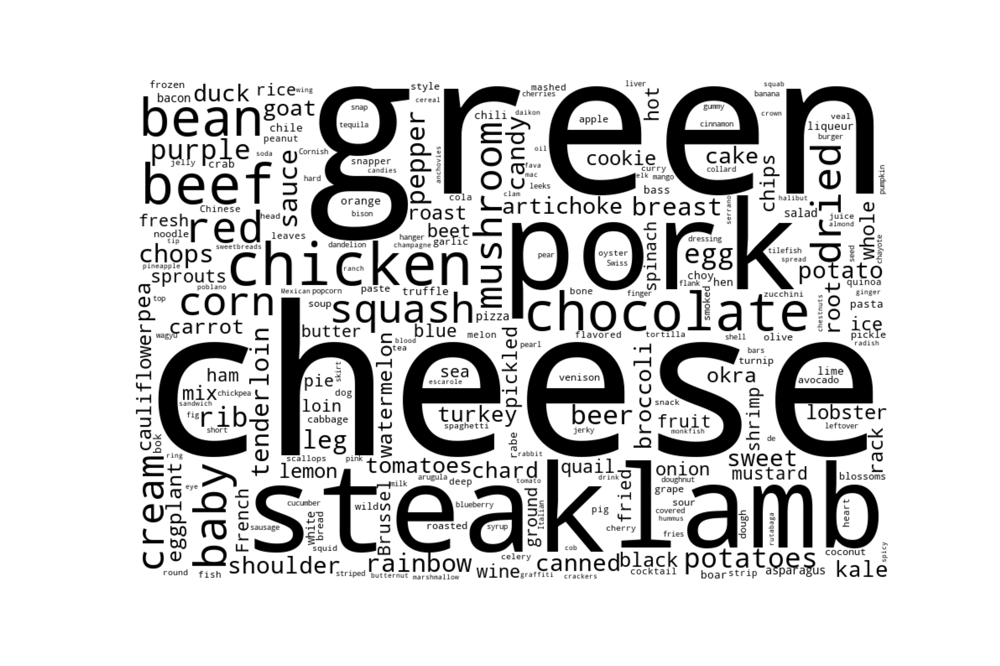
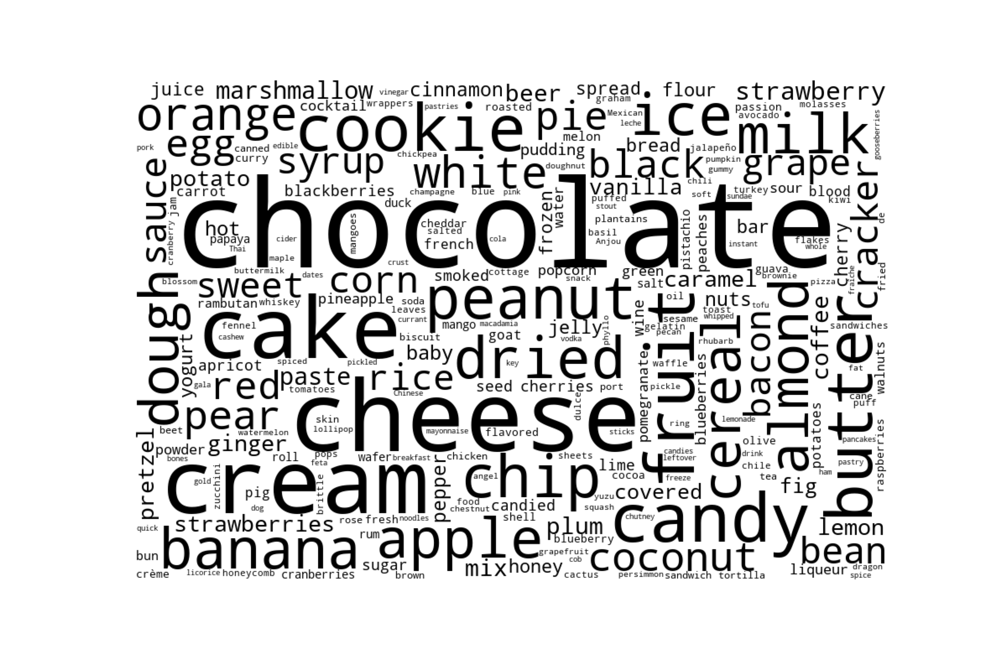

# tidytuesday submissions

Tidy Tuesday is a weekly data visualization project that provides interesting (but not entirely clean) datasets and invites the community to share their findings. This challenge has inspired and pushed me to learn new ways to clean and visualize data. Below are some of my entries. 

## 2020 Week 19: Animal Crossing
[Link to code](https://github.com/monikered/tidytuesday-py/blob/master/code/2020_19_animalcrossing)

## 2020 Week 31: Palmer Penguins
[Link to code](https://github.com/monikered/tidytuesday-py/blob/master/code/2020_31_penguins)

## 2020 Week 35: Chopped
[Link to code](https://github.com/monikered/tidytuesday-py/blob/master/code/2020_35_chopped.py)

Ingredient Words in the Appetizer Round

Ingredient Words in the Entree Round

Ingredient Words in the Dessert Round

